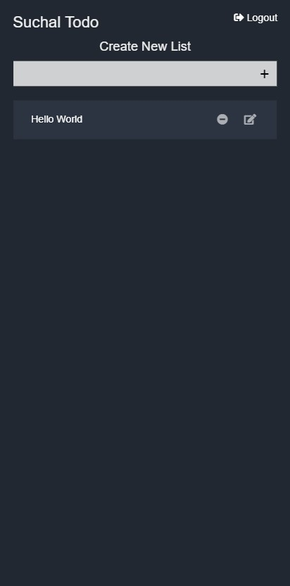
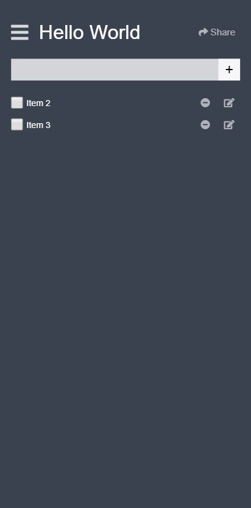
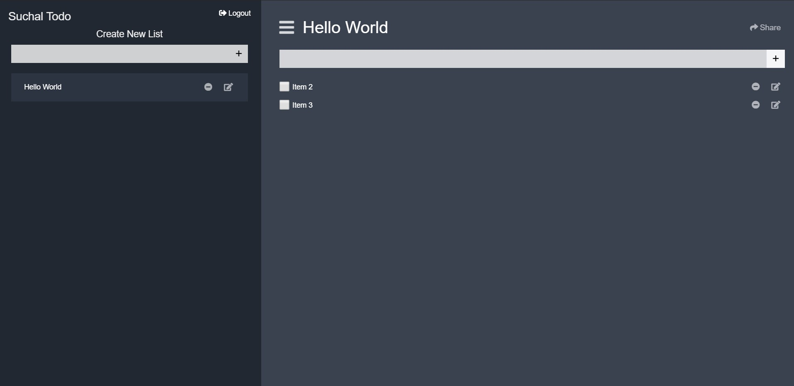

# Todo App made for ZIRO
This is a TODO app made according to the requirements sent by ZIRO recruitment team as a skill test.
## Technologies Used
* Laravel 6.0
* Vue.js 2
* MySQL
* GIT
## Features
* Responsive and Mobile Friendly
* Very Fast and easy to use Frontend
* You can share TODO list with other users
* Authorization and Authentication of users

## Screenshots
### Mobile

### Desktop

